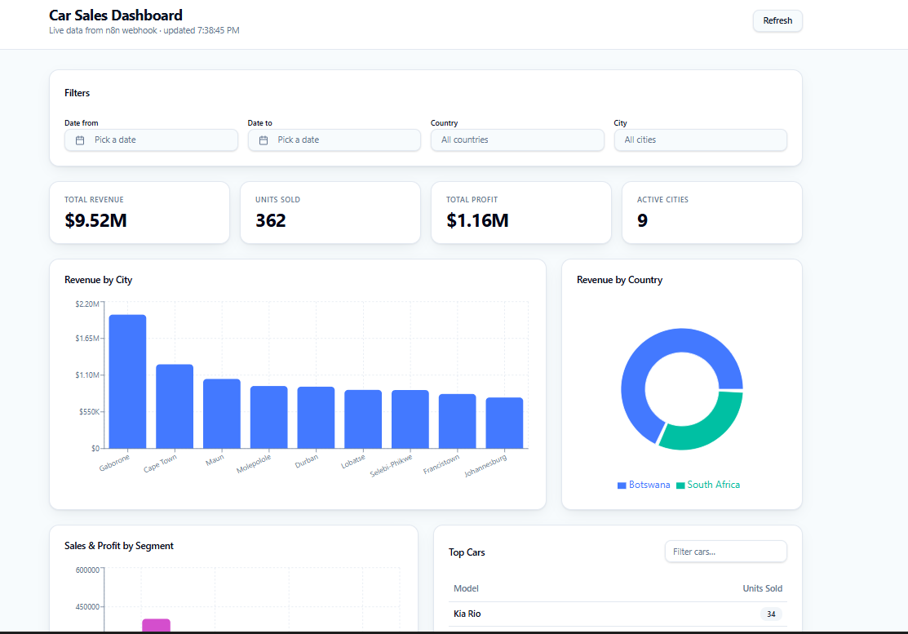
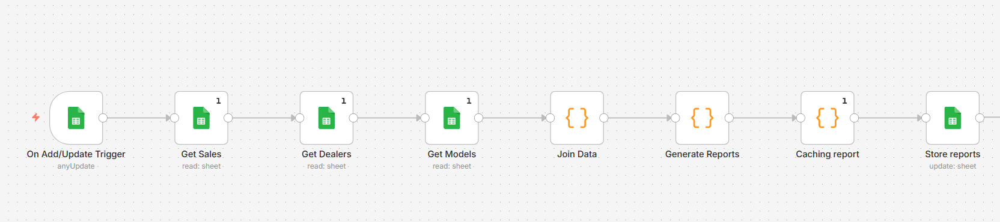
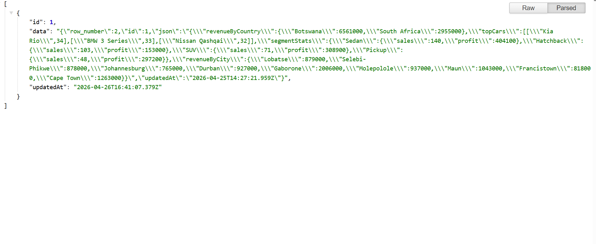

# sales-intelligence-platform

## Automated sales reporting platform using n8n, Google Sheets, and Lovable dashboard

## 📊 Overview

This project automates sales reporting using n8n workflows, Google Sheets as a data source, and a real-time dashboard.

It demonstrates a full data pipeline:

- Data ingestion
- Transformation
- Caching
- API exposure
- Visualization

---

## 🧱 Architecture

---

## 🌐 API Response Example

## ⚙️ Features

- Automated ETL pipeline
- Real-time data processing
- Cached analytics layer
- REST API via webhook
- Interactive dashboard

---

## 🛠 Tech Stack

- n8n (automation)
- Google Sheets (database)
- Lovable (frontend dashboard)

---

## 🔄 Workflow Design

### 1. Data Processing

- Trigger: Row added/updated
- Aggregates sales data
- Stores results in cache

### 2. API Layer

- Webhook endpoint
- Reads cached data
- Returns JSON response

---

## 🌐 API Endpoint

GET /webhook/car-sales-dashboard

---

## 📸 Screenshots

### Workflow

### Dashboard

---

## 🚀 Getting Started

See [Setup Guide](docs/setup-guide.md)

---

## 📌 Future Improvements

- Add query filters (country, city)
- Add AI-based analytics queries
- Multi-client support
- Cloud deployment

---

## 🚀 Live Demo

Visit: https://kephawebhook-canvas-art.lovable.app

## 👤 Author

Kepha Marasi
